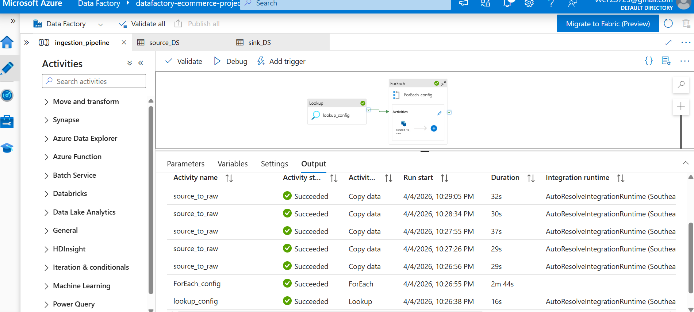
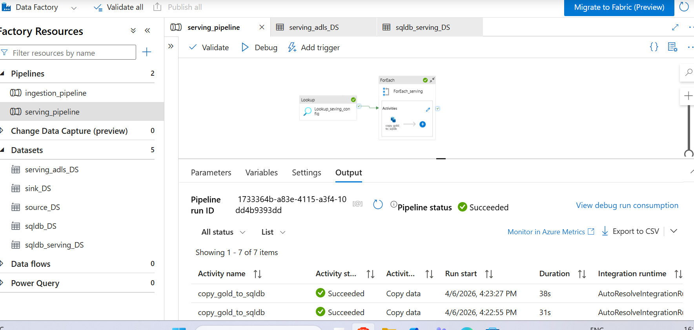
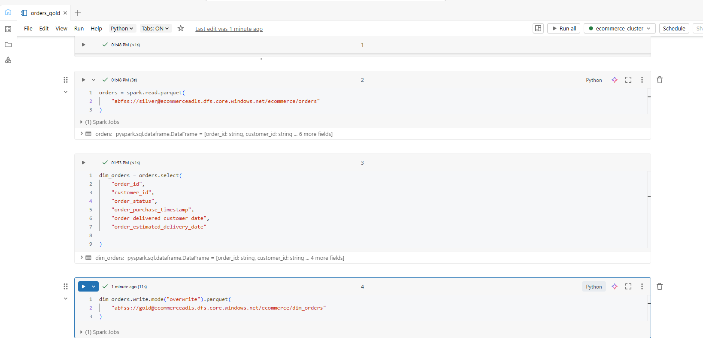
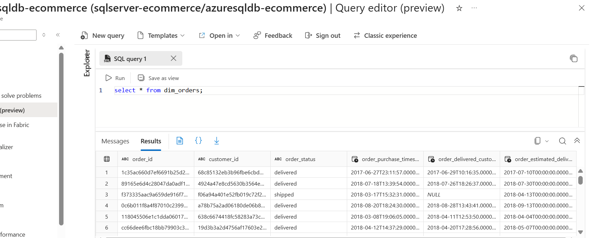

#  Brazilian E-Commerce Data Engineering Project

## 📌 Overview

This project demonstrates an end-to-end data engineering pipeline built using Azure services.
Data is ingested from source, processed through Raw, Silver, and Gold layers, and finally loaded into Azure SQL Database for analytics.

---

## 🏗️ Architecture

![Architecture]

---

## ⚙️ Tech Stack

* Azure Data Factory
* Azure Data Lake Storage Gen2
* Azure Databricks (PySpark)
* Azure SQL Database

---

## 🚀 Pipeline Design

### 🔹 Ingestion Layer

* Data ingested using Azure Data Factory
* Metadata-driven pipeline using control table
* Stored in Raw layer (ADLS)

### 🔹 Silver Layer

* Data cleaning and transformation using Databricks
* Handled null values, duplicates, and data types

### 🔹 Gold Layer

* Implemented star schema for analytics

**Fact Table:**

* fact_order_items

**Dimension Tables:**

* dim_customers
* dim_products
* dim_sellers
* dim_orders

### 🔹 Serving Layer

* Data loaded into Azure SQL Database using ADF
* Metadata-driven pipeline using serving_config

---

## 📊 Screenshots

### Architecture

### ADF Pipeline

Ingestion pipeline:

Serving pipeline:

### Databricks Transformations

### SQL Output

---

## ⭐ Key Features

* End-to-end data pipeline
* Medallion architecture (Raw → Silver → Gold)
* Metadata-driven pipelines
* Modular notebook design

---

## 💡 Learnings

* Built scalable pipelines using Azure services
* Implemented star schema for analytics
* Understood real-world data engineering workflow

---

## 🔮 Future Improvements

* Add data quality checks
* Implement incremental loading
* Integrate Power BI for reporting

---

## 👩‍💻 Author

Anusha Vadlamudi
